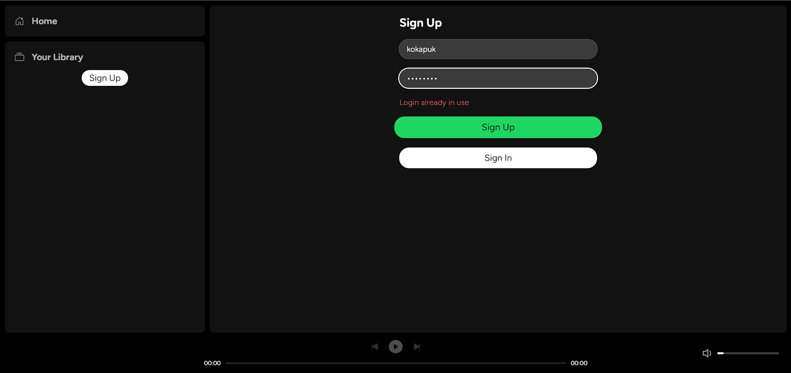
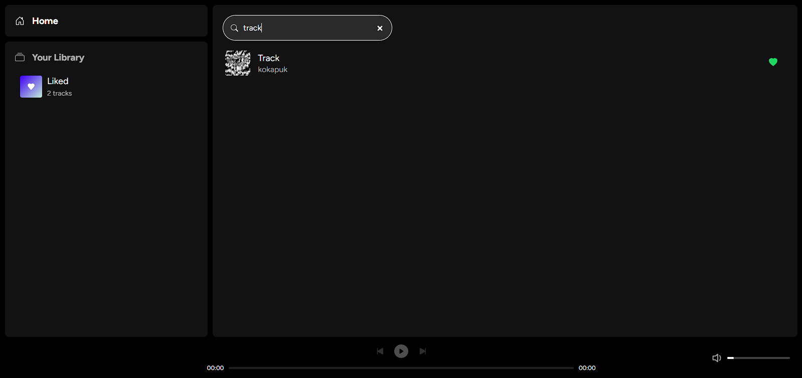
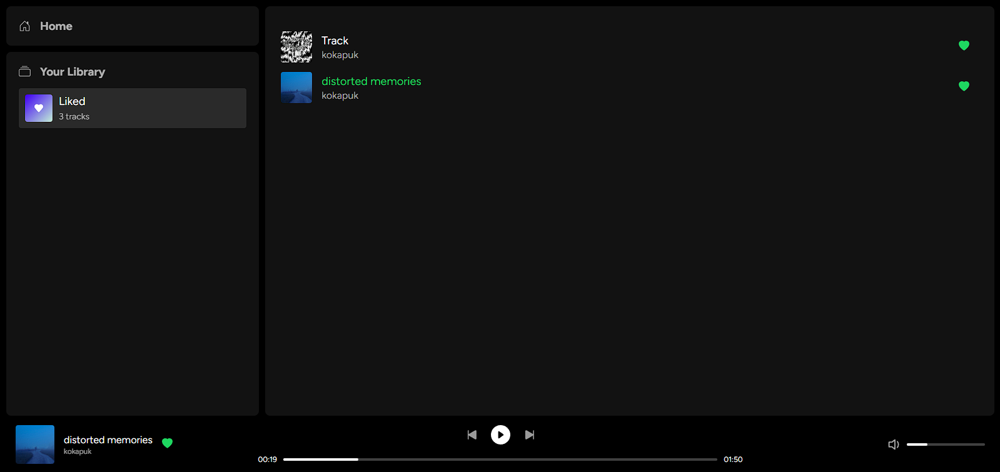

# Spotify

- On Backend **(JavaScript)**
  - [Express](https://expressjs.com)
  - [express-validator](https://express-validator.github.io)
  - [JSON Web Tokens](https://jwt.io)
  - [MongoDB](https://www.mongodb.com) / [mongoose](https://mongoosejs.com)
  - [multer](https://www.npmjs.com/package/multer)
- On Frontend **(TypeScript)**
  - [Next.js](https://nextjs.org)
  - [React](https://react.dev)
  - [Moment.js](https://momentjs.com)
  - [Axios](https://axios-http.com)
  - [JSON Web Tokens](https://jwt.io)
  - [Redux](https://redux.js.org) / [Redux Toolkit](https://redux-toolkit.js.org)
  - [Sass](https://sass-lang.com)

# 

# 

